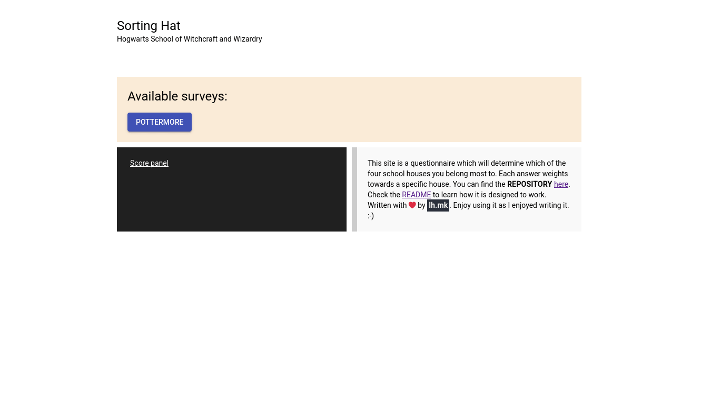

# Sorting hat
[](LICENSE.md)

This repository hosts a questionnaire/survey/quiz-like application, which consist of a backend that is agnostic of the type of survey the user is taking, and a frontend that is specific to the topic of the survey.

It is using **Angular** as it's frontend, including **apollo** and **graphql** both on the front and the back. **NestJS** for the backend and **prisma** as a Node.js/TypeScript ORM, with an **sqlite** database.



---

In this **README** I use questionnaire/survey/quiz interchangeably, but I really mean of an application that gives you possible questions and answers, and with each answer on a question you score points towards a final result.


_view in bigger resolution [here](https://raw.githubusercontent.com/lubeskih/sorting-hat/main/docs/assets/decision-tree.png)_

**Table of Contents**

- [How to build and run](#How-to-build-and-run)
- [How it works](#How-it-works)
    - [Matrix](#Matrix)
    - [Survey](#Survey)
    - [User](#User)
- [Scoring and decisions](#Decision)
- [Database models and relations diagram](#Database-models-and-relations-diagram)


## How to build and run

```bash
$ git clone https://github.com/lubeskih/sorting-hat.git
$ cd sorting-hat
$ docker-compose up # -d (optionally)
```

Docker will try to start the applications on ports `4200` and `3000`, so make sure those are open and not used on your machine. Otherwise you'll have to change the Docker configuration to your desired ports.

After the images are built and containers are running, visit `localhost:4200`. The `POTTERMORE` survey is following this JSON structure: [hp_survey.json](api/src/parser/service/hp_survey.json) and is seeded automatically by the `ParserService`, which parses and validates the file, and seeds the database if it is not already seeded.

## How it works

The full application is divided in two parts: a `backend` and a `frontend`. The `backend` survey engine is independent of the topic of the survey on the frontend. For example, this frontend hosted here is a survey for Harry Potter fans. But it can really be any kind of survey as long as it involves scoring points per given answer. 

The backend understands three concepts:

* **Matrix**
* **Survey**
* **User**

### Matrix

I use the word **matrix** to describe an array of objects, where each object keeps a unique answer and an array of numbers which represent the score that the answer brings towards the final outcomes.

The "source of truth" comes from a JSON file (find the application's JSON [here](api/src/parser/service/hp_survey.json)), which holds a structure that the backend parses/validates and then seeds the database. In a real-world situation you would have a nice frontend that would let the user make their own survey structure in a more user-friendly way, instead of writing JSON in a file. For example, the JSON structure for a matrix looks like this:

```JSON
{
    "matrix": [
        {
            "surveyTitle": "pottermore",
            "bias": [3, 2, 1, 0],
            "surveyMatrix": [
                {
                    "answerId": 1,
                    "matrixId": 1,
                    "score": [100, 100, 0, 0]
                },
                {
                    "answerId": 2,
                    "matrixId": 1,
                    "score": [0, 0, 100, 100]
                }
            ]
        }
    ]
}

```

### Survey

A **Survey** is a structure that consists of:
* A name of the survey
* An ID of the matrix it's answers are being weighted
* Array of questions

A **Question** is an object that consists of:
* A **value**, or the question itself
* **answerChoice**, which is later send to the frontend to decide how the user should answer it's answers (text input, radio button, normal button).
* **parentSurveyId** the survey id that the question is a child of.
* **lastQuestion** which is a boolean that specifies if that question is the last question of the survey.
* Array of answers

An **Answer** is an object that has:
* A value, or the answer itself
* **parentQuestionId** which is the ID of it's parent
* **nextQuestionId** which is the ID of the next question that should be asked if that answer is chosen. This property gives the survey a tree-structure navigation.

A JSON structure for a survey looks like this:

```JSON
{
    "survey": [
        {
            "surveyTitle": "pottermore",
            "scoreMatrixId": 1,
            "questions": [
                {
                    "value": "Dawn or dusk?",
                    "answerChoice": "radio_button",
                    "parentSurveyId": 1,
                    "lastQuestion": false,
                    "answers": [
                        {
                            "value": "Dawn",
                            "parentQuestionId": 1,
                            "nextQuestionId": 2
                        },
                        {
                            "value": "Dusk",
                            "parentQuestionId": 1,
                            "nextQuestionId": 2
                        }
                    ]
                },
            ]
        }
    ]
}
```

### User
A user is just an entity in database that has an unique session token as soon as they start a survey. The session token is kept is session storage, and is being sent upon each answer, so it can be recorded, and later linked against the score matrix to calculate the score. Each user can have a `user answer`, which is just a record of which user selected which answer on which question.


## Scoring and decisions

When a user chooses and answers and continues to the next question, the `DecisionsService` is recalculating it's score towards the possible final outcomes.

This diagram shows how the `DecisionsService` is doing the calculations:


_view in bigger resolution [here](https://raw.githubusercontent.com/lubeskih/sorting-hat/main/docs/assets/scoring.png)_

What we see here is, each column of the answer matrix represents points given to each house. For each column, the values are added, which represent the total score of one house. After we find the total score of each house, those scores are added to find the total score of all houses together.

The **bias** is a preference towards a final outcome, it is used in case two houses have the same score. (you'd say it's unfair, and I'd agree, but then it's a _bias_).

Then, we find percentage with:

```
score = 100 * (score_house / score_total)
```

## Database models and relations diagram
<br>


_view in bigger resolution [here](https://raw.githubusercontent.com/lubeskih/sorting-hat/main/docs/assets/relations.png)_

## License

This software is licensed under [MIT](LICENSE.md).
